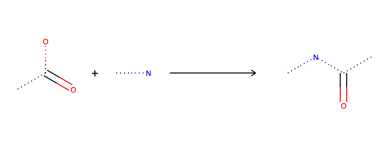
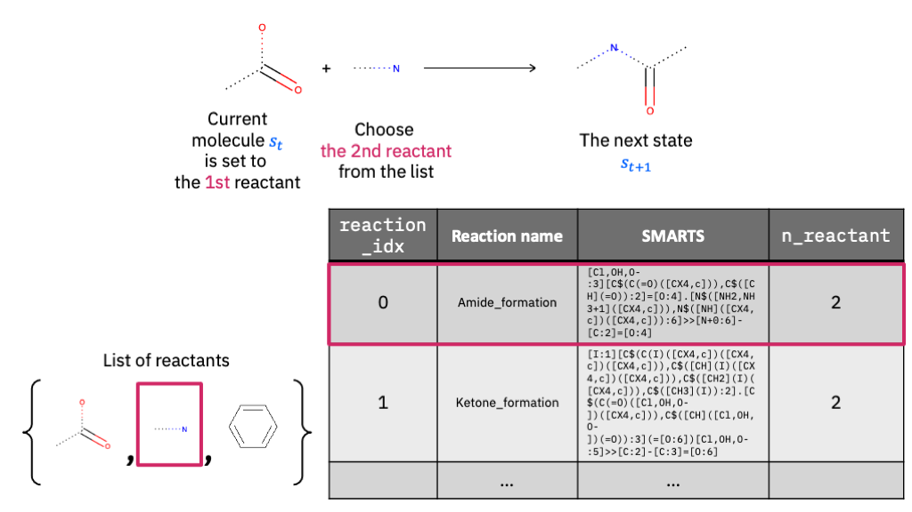

# Gym environments for molecular generation

This repository provides Python scripts to reproduce the results reported in ``Biases in Evaluation of Molecular Optimization Methods and Bias Reduction Strategies''.

## Prerequisites

Install dependencies in `externals` by going to each directory and run

```bash
pip install .
```

## Install

```bash
conda install -c rdkit rdkit
pip install .
```

## For reproductions

Go to `tasks` directory and run:

```bash
python main.py PlotBiasEstimation --working-dir 20220120 [--workers (# of available workers)]
python main.py PlotBiasEstimation --working-dir 20220125_bc_weight [--workers (# of available workers)]
```


## How to use the environment
The simplest environment is initialized as follows.
The goal is to find a molecule that maximizes the penalized log P score.

```python
from molgym.chem.qsar import PenalizedLogP
from molgym.space import ReactionSpace
from molgym.env import GoalRewardReactionEnv

logp = PenalizedLogP()
action_space = ReactionSpace('path/to/reactant/file', 'path/to/reaction/file')
env = GoalRewardReactionEnv(qsar_model=logp.predict, action_space=action_space)
```

The reactant file contains one molecule in the SMILES format per one line:
```
CC(=O)O
NC
c1ccccc1
```
and the reaction file is a tsv file containing a pair of a reaction name and its SMARTS representation per one line:
```tsv
amide_bond_formation	[C:1](=[O:2])-[OD1].[N!H0:3]>>[C:1](=[O:2])[N:3]
Ketone_formation	[I:1][C$(C(I)([CX4,c])([CX4,c])([CX4,c])),C$([CH](I)([CX4,c])([CX4,c])),C$([CH2](I)([CX4,c])),C$([CH3](I)):2].[C$(C(=O)([Cl,OH,O-])([CX4,c])),C$([CH]([Cl,OH,O-])(=O)):3](=[O:6])[Cl,OH,O-:5]>>[C:2]-[C:3]=[O:6]
```

The reason why we first have to initialize the action space is because it is time consuming to initialize it. Internally it precomputes which reactant can be used for which reaction, and we wish to re-use the precomputed result for different environments.


## Environment
The environments are defined in `molgym.env`.
`ReactionEnvBase` defines the base class of the environment, and there are two environments, `AlwaysRewardReactionEnv` and `GoalRewardReactionEnv`, which have different reward functions as will be clarified in the following.

### State space
A state corresponds to a text representation of a molecule called SMILES, and the state space is defined as `molgym.space.SMILES`.
The user has to provide `max_char` to initialize the state space, which determines the maximum number of characters for the text representation.
Each state can be translated into/back from one molecule, and we sometimes call the current state as __the current molecule__.

### Action space
An action corresponds to a chemical reaction applied to the current molecule.



First of all, let us explain how chemical reactions are modeled in this environment.
Chemical reactions are modeled by the SMARTS-based language; each reaction is represented by a rewriting rule of a molecular graph.
For example, amide bond formation can be written as `[C:1](=[O:2])-[OD1].[N!H0:3]>>[C:1](=[O:2])[N:3]`, which has two reactants and yields one product.
Any molecule that has substructure `[C:1](=[O:2])-[OD1]` is eligible for the first reactant, and any molecule that has substructure `[N!H0:3]` is eligible for the second reactant. The matched substructures are rewritten into `[C:1](=[O:2])[N:3]` to yield the product.
In the figure above, this reaction template is applied to `CC(=O)O` and `NC` as the first and second reactants, and the resultant product is `CNC(C)=O`.
See [RDKit](https://www.rdkit.org/docs/GettingStartedInPython.html#chemical-reactions) for its implementation.



An action is a `dict` object, consisting of (i) whether or not to stop the reaction process, (ii) a reaction template, (iii) the position of the current molecule in the template (e.g., the current molecule serves as the first/second/... reactant), and (iv) molecules serving as the other reactants.
In the example above, the action is: 
```python
{'stop': 0, 'reaction_idx': 0, 'reaction_idx': 0, 'current_mol_pos': 0, 'reactant_list': [1]}
```
assuming that `self.max_reactant=2`. Below are the detailed descriptions of each action component.

| Key               | Value                                                                                                 | Description                                                                                    | 
| ----------------- | ----------------------------------------------------------------------------------------------------- | ---------------------------------------------------------------------------------------------- | 
| `stop`            | 0/1                                                                                                   | If 1, stop the reaction process and output the current molecule without any further reactions. | 
| `reaction_idx`    | 0,...,`self.n_reaction`-1                                                                             | Index of the reaction to be applied.                                                           | 
| `current_mol_pos` | 0,...,`self.reaction_list[reaction_idx].n_reactant`-1                                                 | The position of the current molecule in the reaction template.                                 | 
| `reactant_list`   | list of length `self.max_reactant`-1, each of the element is an integer from 0 to `self.n_reactant`-1 | Reactants other than the current molecule.                                                     | 


### State transition
Given the current molecule and an action, the next state is obtained by applying the reaction to the current molecule.
If there are multiple candidates of the products, the environment chooses one of them uniformly randomly.
Note that this random behavior does not necessarily reflect the actual chemical reaction process; it is random because we cannot decide which product is correct.

### Reward
The reward function is computed based on `(s, a, s', done)`, where `done` is `True` when the agent sets `stop=1` or the number of reactions exceeds `max_step`. There are two variants of reward definitions.

#### AlwaysRewardReactionEnv
The first one always rewards the agent with the target property to be maximized. Specifically,

1. If done, there is no reward.
1. If not done & if the product molecule is different from the current molecule (=when the reaction succeeds), the agent is rewarded the target property
1. If not done & if the product molecule is the same as the current molecule (=when the reaction fails), the agent is rewarded the penalty reward, which is set to `-10`.

See `AlwaysRewardReactionEnv` for the implementation.

#### GoalRewardReactionEnv
The second one rewards the agent with the target property to be maximized, only when the environment status is done. Specifically,

1. If done, the agent is rewarded the target property of the product molecule, which is the same as the current molecule when `done=True`.
1. If not done & if the product molecule is different from the current molecule (=when the reaction succeeds), the agent is rewarded nothing.
1. If not done & if the product molecule is the same as the current molecule (=when the reaction fails), the agent is rewarded the penalty reward, which is set to `-10`.

See `GoalRewardReactionEnv` for the implementation.

